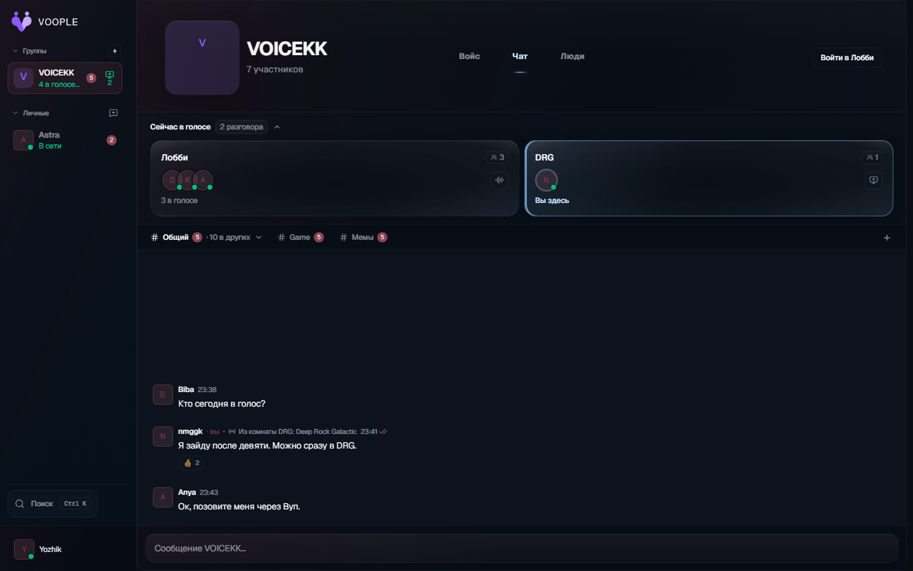
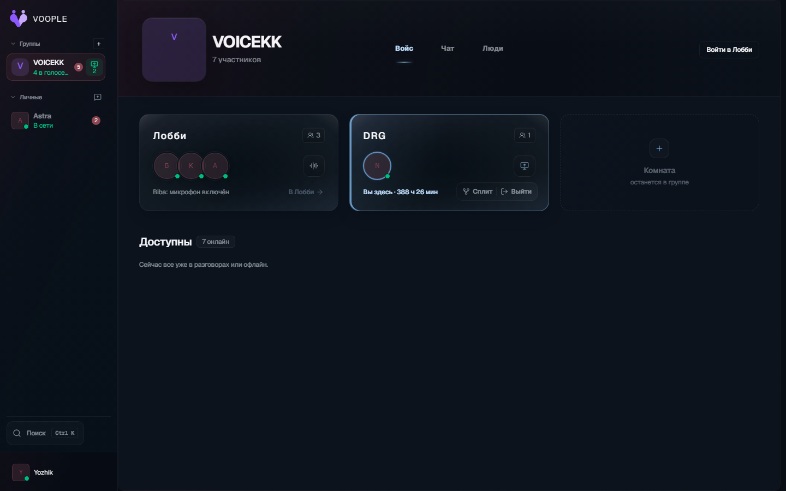
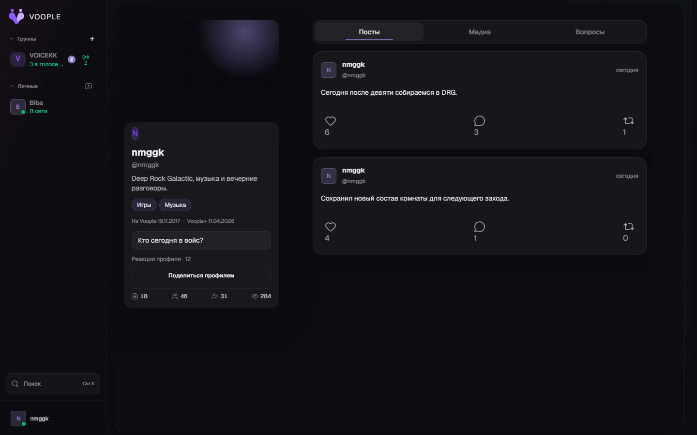

<p align="center">
  
</p>

<h1 align="center">Voople</h1>

<p align="center">
  Приложение для постоянных компаний друзей: группы, переписка и несколько голосовых комнат в одном контексте.
</p>

<p align="center">
  <a href="https://voople.app">Открыть web</a>
  ·
  <a href="https://github.com/GalitskyKK/voople/releases/latest">Скачать для Windows</a>
  ·
  <a href="https://github.com/GalitskyKK/voople/issues">Сообщить о проблеме</a>
</p>

> [!IMPORTANT]
> Репозиторий готовится к публичной beta. Статус отдельных сценариев и их
> проверок ведётся в [матрице готовности](./docs/product-delivery-matrix.md).

## Группа

Группа хранит постоянный состав, общий чат и разделы. Вкладки «Войс», «Чат» и
«Люди» используют один список групп и личных диалогов в боковой панели.



## Войс

Лобби — общий голосовой разговор группы. Дополнительные комнаты остаются внутри
той же группы. Split создаёт временную комнату, Switch переводит между
комнатами, Voop адресно зовёт человека отойти вместе.



## Профиль

Профиль содержит identity, статус, интересы, реакции и публикации. Web и desktop
используют общие компоненты профиля и ту же messenger-навигацию.



## Основные сценарии

- постоянные группы и личные диалоги;
- общий чат группы и отдельные разделы;
- Lobby, Room, Split, Switch и Voop;
- демонстрация экрана и сообщения из активной комнаты;
- приглашение человека, группы или гостя по ссылке;
- гостевой вход в конкретную комнату без доступа к истории группы;
- profile identity и Group+ оформление;
- web-приложение и Windows desktop на общей продуктовой основе.

## Проверка

```bash
npm run check:architecture
npm run test:unit
npm run lint
npx tsc --noEmit
npm run build
```

Актуальные продуктовые кадры создаются из реальных shared-компонентов, а не из
отдельных макетов:

```bash
node scripts/verify-core-rework-group-surface.mjs --capture-dir public/landing --capture-only
node scripts/verify-profile-visual.mjs --capture-dir public/landing
```

## Лицензия

Код распространяется по [GNU AGPL v3](./LICENSE). Для названия, логотипа и
first-party материалов действуют отдельные [правила бренда](./TRADEMARKS.md) и
[правила ассетов](./ASSET_POLICY.md).

До отдельной юридической проверки contributor agreement значимые внешние
изменения обсуждаются в issues; подробности — в [CONTRIBUTING.md](./CONTRIBUTING.md).
