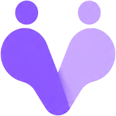
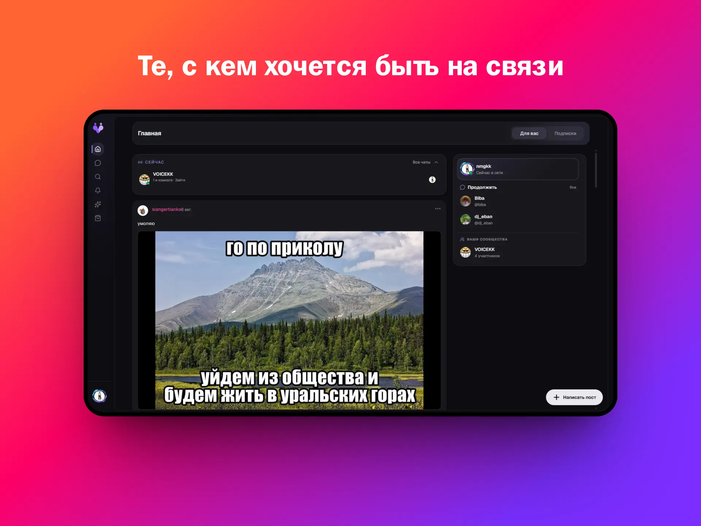
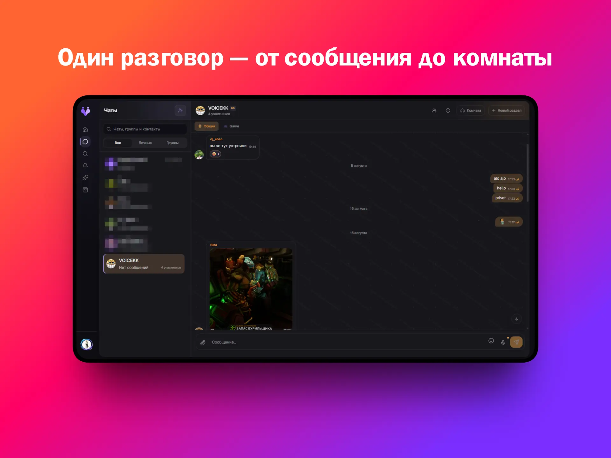
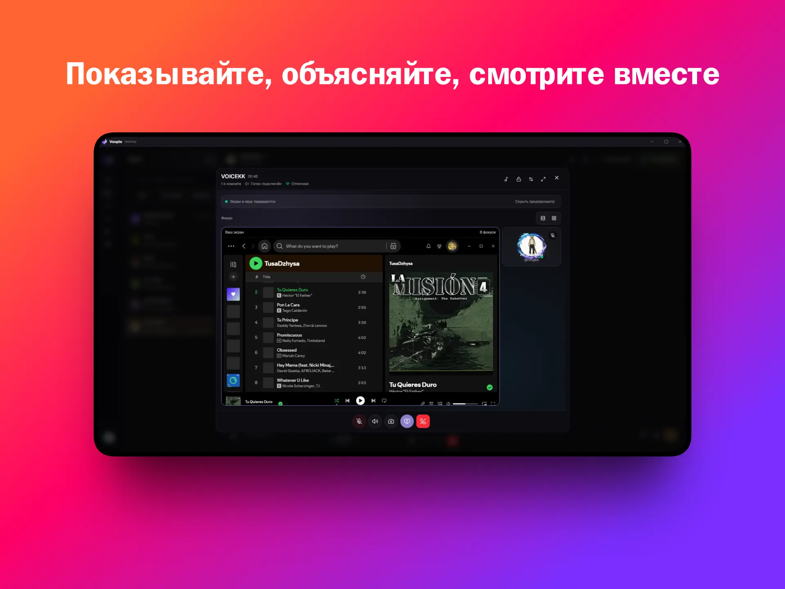
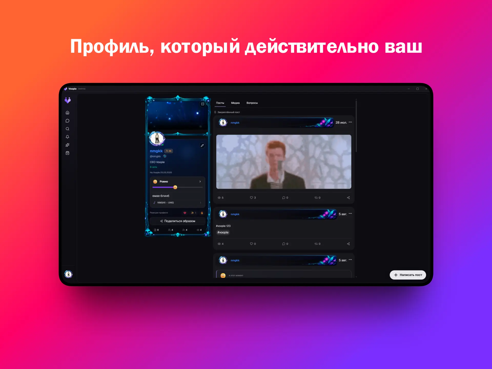

  

<h1 align="center">Voople · вупл.</h1>

  Социальное пространство для тех, с кем хочется быть на связи. 
  Чаты, сообщества, голосовые комнаты, демонстрация экрана и профиль — в одном месте.

  <a href="https://github.com/GalitskyKK/voople/releases/latest">Скачать для Windows</a>
  ·
  <a href="https://github.com/GalitskyKK/voople/issues">Сообщить о проблеме</a>
  ·
  <a href="./SECURITY.md">Безопасность</a>

> [!IMPORTANT]
> Voople активно развивается. Основные сценарии уже работают, но интерфейс,
> архитектура и платформенная поддержка ещё последовательно доводятся до
> полноценного продукта.

## Не ещё одна лента ради ленты

Voople задуман как место, куда приходят не смотреть на пустой стартовый экран,
а продолжать общение. Можно написать человеку, собрать сообщество по интересам,
перейти из переписки в комнату и показать экран — без смены нескольких
приложений.

## Общение не заканчивается сообщением

В личных и групповых чатах живут сообщения, разделы сообщества и голосовые
комнаты. Если текста мало, можно перейти в разговор, включить демонстрацию окна
или экрана и остаться в том же контексте.

## Профиль должен быть вашим

Voople развивает не только аватар и имя, а цельную систему самовыражения:
оформление профиля, карточки, теги, значки и другие кастомизации должны одинаково
работать в большом профиле, мини-профиле, чатах и сообществах.

Точный список кадров, состояния интерфейса и рекомендации для shots.so лежат в
[плане скриншотов](./docs/readme-shot-list.md).

## Что уже есть

- web-приложение и desktop-клиент для Windows на общей продуктовой основе;
- личные и групповые чаты, разделы сообществ и поиск;
- голосовые комнаты и демонстрация экрана со звуком;
- профили, мини-профили и каталог кастомизаций;
- лента, уведомления, события и магазин;
- обновления desktop-клиента и публичные release notes.

Это не обещание, что каждый крайний случай уже закрыт. Актуальный статус
продуктовых срезов фиксируется в
[матрице готовности](./docs/product-delivery-matrix.md).

## Open source

Исходный код Voople распространяется по лицензии
[GNU AGPL v3](./LICENSE). Изменённая версия, доступная пользователям по сети,
должна предоставлять им соответствующий исходный код на условиях AGPL.

Название Voople, логотип и first-party визуальные материалы не становятся
свободными ассетами автоматически: для них действуют отдельные
[правила бренда](./TRADEMARKS.md) и [правила ассетов](./ASSET_POLICY.md).

Пока contributor agreement не прошёл отдельную юридическую проверку, мы рады
issues и обсуждениям, но не сливаем значимые внешние кодовые изменения. Подробно
это описано в [CONTRIBUTING.md](./CONTRIBUTING.md).

## English

Voople is a social space built around continuing real conversations: messaging,
communities, voice rooms, screen sharing and personal identity in one product.
The interface is Russian-first today; a complete English locale is on the
roadmap rather than being shipped as a partial translation.

The source code is licensed under **AGPL-3.0-only**. Voople branding and
first-party assets follow separate policies.

